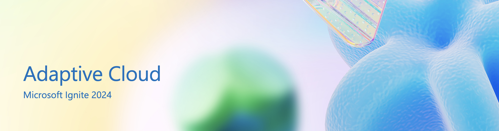

# Adaptive Cloud at Microsoft Ignite 2024

Stay up to date with our Ignite blogs, see all adaptive cloud sessions, and sign up to participate in future product research.

## Blogs

Explore our guide to Adaptive Cloud at Ignite, which includes the latest advancements in Microsoft Azure's [adaptive cloud approach](https://aka.ms/ignite24/blog/adaptivecloudguide), new solutions and offerings, must-attend Ignite sessions, and a full list of links to every adaptive cloud Ignite blog post.

[See the Guide](https://azure.microsoft.com/solutions/hybrid-cloud-app/)

## Sessions

See a our full list of Adaptive Cloud sessions at Microsoft Ignite 2024. As you browse through the session catalog on the  Ignite website, you can also select the "Adaptive Cloud" tag. 

### Breakouts

| **Session**                                                           | **Schedule**                             |
|------------------------------------------------------------------------|------------------------------------------|
| [Windows Server 2025: New ways to gain cloud agility and security](https://ignite.microsoft.com/sessions/BRK238?source=sessions)       | Tuesday, Nov. 19 - 11:30 AM-12:15 PM CDT |
| [Adaptive cloud: Unify hybrid, multi-cloud and edge with Azure Arc](https://ignite.microsoft.com/sessions/BRK235?source=sessions)      | Wednesday, Nov. 20 - 9:45-10:30 AM CDT   |
| [Simplify operations with AI: Copilot, Azure Arc, and Azure Monitor](https://ignite.microsoft.com/sessions/BRK219?source=sessions)     | Wednesday, Nov. 20 - 5:00-5:45 PM CDT    |
| [Operate infrastructure across distributed locations with Azure Arc](https://ignite.microsoft.com/sessions/BRK214?source=sessions)     | Thursday, Nov. 21 - 8:30-9:15 AM CDT     |
| [How AI is transforming the migration economic opportunity for partners](https://ignite.microsoft.com/sessions/BRK247?source=sessions) | Thursday, Nov. 21 - 4:00-4:45 PM CDT     |
| [Scale apps and data with Azure Arc, Kubernetes, and Microsoft Fabric](https://ignite.microsoft.com/sessions/BRK215?source=sessions)   | Thursday, Nov. 21 - 5:00-5:45 PM CDT     |
| [Accelerate industrial transformation with Azure IoT operations](https://ignite.microsoft.com/sessions/BRK262?source=sessions)         | Thursday, Nov. 21 - 5:00-5:45 PM CDT     |
| [Proactively design and build resilient workloads on Azure](https://ignite.microsoft.com/sessions/BRK241?source=sessions)              | Friday, Nov. 22 - 10:15-11:00 AM CDT     |

### Demos

| **Session**                                                            | **Schedule**                            |
|------------------------------------------------------------------------|-----------------------------------------|
| [Enhance cloud native troubleshooting with Azure Monitor & Chaos Studio](https://ignite.microsoft.com/sessions/THR623?source=sessions) | Tuesday, Nov. 19 - 2:00-2:30 PM CDT     |
| [Bringing the power of Azure AI to your adaptive cloud environments](https://ignite.microsoft.com/sessions/THR628?source=sessions)     | Wednesday, Nov. 20 - 10:15-10:45 AM CDT |
| [Fortify critical applications with Azure Business Continuity Center](https://ignite.microsoft.com/sessions/THR520?source=sessions)    | Wednesday, Nov. 20 - 1:15-1:30 PM CDT   |

### Theater

| **Session**                                                            | **Schedule**                           |
|------------------------------------------------------------------------|----------------------------------------|
| [Profitable SPLA Modernization for ISVs & Hybrid Cloud Partners](https://ignite.microsoft.com/sessions/THR676?source=/speakers/991f681d-0645-4ffb-bf2a-0f108c8a3d47)         | Tuesday, Nov. 19 - 2:45-3:15 PM CDT    |
| [Secure, develop and innovate in a hybrid world with Microsoft and Dell](https://ignite.microsoft.com/sessions/THR673?source=sessions) | Tuesday, Nov. 19 - 5:30-6:00 PM CDT    |
| [Windows Server plus Azure Arc - Three new ways to save time](https://ignite.microsoft.com/sessions/THR632?source=sessions)            | Thursday, Nov. 21 - 10:15-10:45 AM CDT |
| [Explore next-gen industrial transformation architecture patterns](https://ignite.microsoft.com/sessions/THR666?source=sessions)       | Thursday, Nov. 21 - 4:15-4:45 PM CDT   |

### Hands-on-Labs

| **Session**                                                              | **Schedule**                                                                                                        |
|--------------------------------------------------------------------------|---------------------------------------------------------------------------------------------------------------------|
| [Accelerate Windows Server modernization and migration with Azure Arc](https://ignite.microsoft.com/sessions/LAB427?source=sessions)     | Tuesday, Nov. 19 - 3:00-4:15 PM CDT,  Wednesday, Nov. 20 - 1:15-2:30 PM CDT,  Thursday, Nov. 21 - 1:15-2:30 PM CDT    |
| [Securing and managing mission critical Windows Servers with Arc](https://ignite.microsoft.com/sessions/LAB431)          | Wednesday, Nov. 20 - 8:30-9:45 AM CDT,  Wednesday, Nov. 20 - 6:30-7:45 PM CDT,  Thursday, Nov. 21 - 4:45-6:00 PM CDT  |
| [Transform industries with Azure IoT, AI, Edge and operational excellence](https://ignite.microsoft.com/sessions/LAB460?source=sessions) | Tuesday, Nov. 19 - 1:15-2:30 PM CDT,  Wednesday, Nov. 20 - 8:30-9:45 AM CDT,  Thursday, Nov. 21 - 10:15-11:30 AM CDT  |

### Online Sessions

| **Session**                                                   | **Schedule**              |
|---------------------------------------------------------------|---------------------------|
| [Modernizing your infrastructure with HPE Hybrid IT technology](https://ignite.microsoft.com/sessions/ODFP945?source=sessions) | Pre-recorded, online only |

## Sign up for Research

We'd love your feedback on Adaptive Cloud strategy, AI/ML, security, Kubernetes, or deployment/management at scale. Please take our brief survey below to help us create products that better meet your needs.

[Take the survey](https://aka.ms/ACX/Ignite24)

Interested in participating in customer research on topics related to Microsoft Azure's adaptive cloud approach? Join our research participant panel through the link below.

[Sign up for Azure User Research](https://ux.microsoft.com/panel/AzureHybrid)