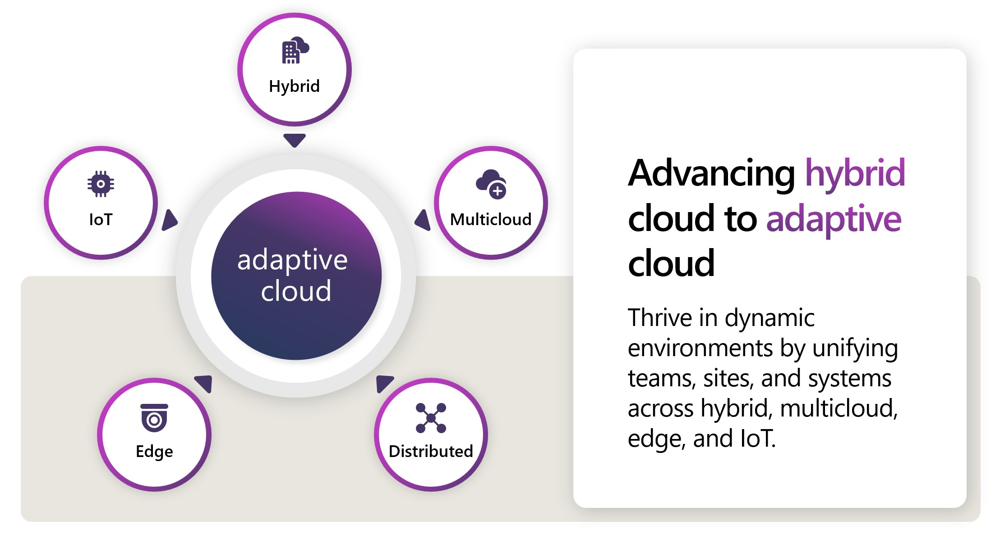

# Azure Adaptive Cloud Community

## Overview

Once a month, the various Adaptive cloud product groups at Microsoft will hold a call to showcase new features, talk through important topics and engage in a Q&A regarding hybrid, multicloud, and edge. The foundational goals of the call are highlighted below:

- Provide the Adaptive cloud community with product updates for products and services such as Azure Arc, Azure Stack HCI, Azure IoT, AKS and much more.
- Host a short talk and/or demo on Azure Adaptive cloud technologies and products technologies
- Collect feedback from the community on issues, blockers, use cases, and questions related to Azure Adaptive cloud technologies and products

## Who is the "community"? 💬

If you are a customer, partner, Microsoft employee, or just someone who loves tech, for us, you are part of our community. The content presented in our calls is **not under a non-disclosure agreement (NDA)** and is public because our mission is just to spread the ❤️ for Azure Adaptive cloud solutions and technologies.

## Meetup agenda 📃

Each monthly meetup will be 1 hour, don't be late, we have a lot to cover 🤓

- 2 minutes: Welcome
- 45-50 minutes: Product updates
- 5-10 minutes: “Ask us anything” and feedback discussion

## Meeting links and recordings ⏺️

| Asset      | Link        |
|:-----------|:------------|
| 🍪 Teams Channel - Guests | [If you are a guest, join the Microsoft Teams channel by submitting this form](https://aka.ms/ArcEdgeCommunityForm)
| 🍪 Teams Channel - Microsoft FTE | [If you are a Microsoft FTE, join the Microsoft Teams channel using this link](https://teams.microsoft.com/l/team/19%3a227a226ae75f4ffabc67f77a9d439d15%40thread.tacv2/conversations?groupId=f4ccf9df-0dc2-4282-a392-652117be03e7&tenantId=72f988bf-86f1-41af-91ab-2d7cd011db47)
| 📝 Meeting presentations | [View](https://github.com/microsoft/azure_arc_community/tree/main/Presentations)
| 🎥 Meeting recordings | [Watch](https://aka.ms/ArcMeetup)
| 📅 Upcoming meetup calendar invite | [Download the _ics_ file](https://1drv.ms/u/s!ApeID0DmHjgfoR6M3zJRR1-xZqmK?e=R4UwEY)
<!-- | 🎤 Azure Hybrid Community AMA (Twitter Spaces) | [Join Ask Me Anything (AMA)](./TwitterSpaces.md) -->

> **NOTE**: If you use Outlook for Mac, you may have trouble adding the invite to your calendar. In order to avoid issues, follow the steps below:

1. Download the _.ics_ file
2. Open Outlook for the web
3. Drag and drop the _.ics_ file onto your calendar

## Schedule 📅

**2024 Upcoming Meetings**:

- April 3rd, 08:00 AM Pacific Time (PT)

<!-- ## Azure Hybrid AMA on Twitter Spaces 🐥

Join Azure Hybrid & Multicloud experts from Microsoft and the MVP community to learn about new product features, releases and to find answers to challenging hybrid and multicloud problems. Live on Twitter! Learn more [here](TwitterSpaces.md/). -->

## Adaptive cloud resources 📄

- [Azure Arc Documentations](https://docs.microsoft.com/azure/azure-arc/)
- [Azure Arc Jumpstart](https://aka.ms/AzureArcJumpstart)
- [Azure Stack HCI Documentations](https://docs.microsoft.com/azure-stack/hci/)
- [Azure Arc Landing Zone Accelerators](https://aka.ms/ArcLZAcceleratorReady)

## Contact Us 📞

Reach out to us on our Teams channel (make sure to use the @General hashtag) or at [distribution list](mailto:arccustomermeetleads@microsoft.com) and we'll make sure to answer your questions as soon as possible!

## Contributing 🛠️

This project welcomes contributions and suggestions.  Most contributions require you to agree to a
Contributor License Agreement (CLA) declaring that you have the right to, and actually do, grant us
the rights to use your contribution. For details, visit https://cla.opensource.microsoft.com.

When you submit a pull request, a CLA bot will automatically determine whether you need to provide
a CLA and decorate the PR appropriately (e.g., status check, comment). Simply follow the instructions
provided by the bot. You will only need to do this once across all repos using our CLA.

This project has adopted the [Microsoft Open Source Code of Conduct](https://opensource.microsoft.com/codeofconduct/).
For more information see the [Code of Conduct FAQ](https://opensource.microsoft.com/codeofconduct/faq/) or
contact [opencode@microsoft.com](mailto:opencode@microsoft.com) with any additional questions or comments.

## Trademarks ™

This project may contain trademarks or logos for projects, products, or services. Authorized use of Microsoft
trademarks or logos is subject to and must follow.
[Microsoft's Trademark & Brand Guidelines](https://www.microsoft.com/legal/intellectualproperty/trademarks/usage/general).
Use of Microsoft trademarks or logos in modified versions of this project must not cause confusion or imply Microsoft sponsorship.
Any use of third-party trademarks or logos are subject to those third-party's policies.
